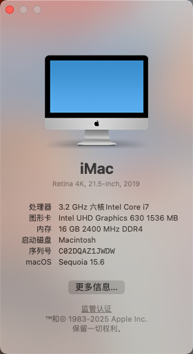

### 配置列表
* CPU: I7-8700
* 显卡: uhd 630核显
* 主板：微星MSI Z370-A Pro
* 无线网卡蓝牙：Intel AX200 PCI-E
* MacOS版本：Sequoia 15.0.1 (24A348)
* 引导加载程序：OpenCore 1.0.2

### BIOS配置
只使用核显，要注意修改BIOS设置，高级（或者芯片组）-显示配置-第一显卡改成IGD

如果使用独显，高级-显示配置-第一显卡改成PEG（PCIE）

### 截图
